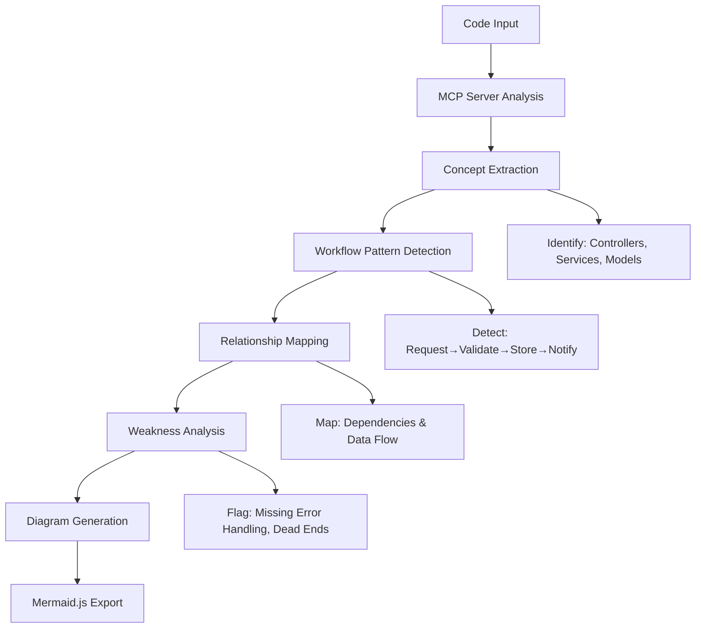

# System Flow Auto-Mapper MCP Server

**🛠 Built for the Trae AI Hackathon 2025 — Intelligent code analysis meets visual workflows**

## Overview

The **System Flow Auto-Mapper** is a **Model Context Protocol (MCP)** server that performs intelligent code analysis by reverse engineering source code into conceptual workflow diagrams while simultaneously detecting architectural weaknesses and security vulnerabilities. Unlike traditional static analysis tools that focus on syntax validation, this system understands business logic patterns and provides actionable insights for improving code quality and security.

## Key Features

- **Conceptual Workflow Detection**: Identifies business logic patterns such as authentication flows, CRUD operations, and request-response cycles
- **Automated Security Analysis**: Detects SQL injection vulnerabilities, missing error handling, input validation gaps, and other security issues
- **Visual Diagram Generation**: Creates Mermaid.js flowcharts, sequence diagrams, and class diagrams with weakness indicators
- **MCP Protocol Integration**: Seamlessly integrates with AI assistants and development environments that support the Model Context Protocol
- **Multi-language Support**: Supports JavaScript, TypeScript, Python, Java, C#, and other programming languages

## Architecture

### High-Level System Flow



## Project Structure

```
system-flow-auto-mapper/
├── src/
│   ├── index.ts                     # Main MCP server entry point
│   ├── analyzers/
│   │   ├── workflow-detector.ts     # Core workflow pattern detection
│   │   ├── weakness-finder.ts       # Security vulnerability analysis
│   │   └── concept-mapper.ts        # Business logic concept extraction
│   ├── generators/
│   │   ├── mermaid-generator.ts     # Mermaid diagram generation
│   │   └── flow-builder.ts          # Workflow structure building
│   ├── parsers/
│   │   ├── ast-parser.ts            # Abstract Syntax Tree parsing
│   │   └── pattern-matcher.ts       # Code pattern matching utilities
│   └── types/
│       └── index.ts                 # TypeScript type definitions
├── dist/                            # Compiled JavaScript output
├── package.json                     # Node.js dependencies and scripts
├── tsconfig.json                    # TypeScript configuration
└── README.md                        # Project documentation
```

## Technology Stack

### Core Technologies
- TypeScript
- Node.js
- Model Context Protocol (MCP)
- Acorn
- Mermaid.js

### Dependencies

**Production**
- @modelcontextprotocol/sdk
- acorn
- acorn-walk
- typescript
- ts-node

**Development**
- @types/node
- @types/acorn

## Available Tools

### 1. analyze_code
**Purpose**: Workflow + security + architecture analysis

**Parameters**:
- `code` (required)
- `language` (optional)
- `diagramType` (optional)

**Use Cases**:
- Code review automation
- Security audit prep
- Onboarding architecture walkthroughs

### 2. generate_mermaid
**Purpose**: Mermaid.js visual diagrams

**Parameters**:
- `code` (required)
- `diagramType` (optional)

**Use Cases**:
- Docs & presentations
- System design reviews
- Code visualization

### 3. find_weaknesses
**Purpose**: Vulnerability scanning

**Parameters**:
- `code` (required)
- `language` (optional)

**Use Cases**:
- Compliance checks
- Quality gate in CI/CD
- Security training

## Installation and Setup

### Prerequisites
- Node.js 16+
- npm or yarn
- Trae AI IDE (or any MCP-compatible editor)

### Steps
1. Clone the repository:
   ```bash
   git clone <repository-url>
   cd system-flow-auto-mapper
   ```

2. Install dependencies:
   ```bash
   npm install
   ```

3. Build the project:
   ```bash
   npm run build
   ```

4. Run the server:
   ```bash
   node dist/index.js
   ```

**Expected output:**
```
System Flow Auto-Mapper MCP server running on stdio
```

## Trae AI Integration

### Configure MCP Server
1. Open Trae AI → Settings → MCP Servers
2. Or: Use "Configure MCP Servers" from the Command Palette
3. Add this configuration:

```json
{
  "mcpServers": {
    "system-flow-auto-mapper": {
      "command": "node",
      "args": [
        "/absolute/path/to/system-flow-auto-mapper/dist/index.js"
      ],
      "env": {},
      "timeout": 30000,
      "restart": true
    }
  }
}
```

**Note**: Replace `/absolute/path/to/` with the actual project path.

4. Restart Trae AI after saving changes.

## Usage Examples in Trae AI

### 🔎 Code Analysis
```
Analyze this authentication code for security vulnerabilities:
[paste your code here]
```

### 🧠 Workflow Diagram
```
Generate a flowchart diagram for this payment processing system:
[paste your code here]
```

### 🔐 Security Audit
```
Perform a security audit on this file upload function:
[paste your code here]
```

### 🧪 Tool Specific
```
Use find_weaknesses to examine this DB query:
[paste your code here]
```

## Configuration Options

- `timeout`: max analysis time (default 30000ms)
- `restart`: auto-restart on crash
- `env`: custom environment variables

### Parameters
- Language Detection
- Severity Levels
- Complexity Thresholds

## Supported Languages

- ✅ **Full Support**: JavaScript, TypeScript
- ⚠️ **Partial Support**: Python, Java, C#, PHP
- 🌐 **Generic Support**: Regex + heuristics

## Security Capabilities

- SQL Injection
- Cross-Site Scripting (XSS)
- Path Traversal
- Authentication Bypass
- Input Validation Gaps
- Error Handling Absence

## Architecture Insights

- Separation of Concerns
- Resource Cleanup
- Concurrency & Race Conditions
- DB Transaction Safety

## Recognized Patterns


### Data Processing
- CRUD Operations
- Validation Pipelines
- ETL Workflows

### Communication
- API Request/Response
- Messaging Queues
- Event Handling

## Output Formats

- **Reports**: JSON w/ severity, locations, fixes
- **Visuals**: Mermaid.js + SVG
- **Interactive**: Hover + highlight features

## Performance

- Memory optimized AST
- Fast execution w/ timeout config
- CI/CD ready
- Auto-cleanup analysis artifacts

## Troubleshooting

### Can't Connect?
- Check absolute path in config
- Verify node is in PATH
- Confirm file permissions

### Analysis Errors?
- Validate syntax of input code
- Confirm correct language is set
- Increase timeout if needed

### Debug Mode
Enable verbose logging:

```json
{
  "env": {
    "DEBUG": "mcp:*",
    "LOG_LEVEL": "debug"
  }
}
```

## Contributing

1. Fork the repository
2. Create a feature branch (`git checkout -b feature/amazing-feature`)
3. Commit your changes (`git commit -m 'Add some amazing feature'`)
4. Push to the branch (`git push origin feature/amazing-feature`)
5. Open a Pull Request


## Acknowledgments

- Built for the Trae AI Hackathon 2025
- Powered by the Model Context Protocol
- Special thanks to the Trae AI community


